# 🎡 Kubernetes Deployments Telemetry Playground 🚀

[](https://kubernetes.io)
[](https://expressjs.com)
[](https://redis.io)
[](https://www.chartjs.org)
[](#)

Welcome to the **Kubernetes Deployments Telemetry Playground**! 🌟 This application is an immersive, hands-on learning environment designed to demonstrate zero-downtime **Blue-Green** switches and traffic-split **Canary** releases using a live, glassmorphic telemetry dashboard. 📊

---

## 📚 1. Core Educational Concepts

Understanding how traffic behaves during deployments is essential for modern DevOps. This playground lets you visualize the two most popular strategies:

### 🔵🟢 Blue-Green Deployment
* **What is it?** 🚀 You run two identical production environments: "Blue" (active stable version) and "Green" (new staging version). 
* **The Switch:** 🔄 You switch 100% of traffic from Blue to Green at the routing layer (Kubernetes Service selector) instantly.
* **Why use it?** 🛡️ Zero downtime and instant rollback capabilities. If Green fails, you switch the router back to Blue in milliseconds!

### 🐤 Canary Rollout
* **What is it?** 🧪 You deploy a single replica of the new version (the "Canary") alongside the existing stable version.
* **The Switch:** ⚖️ The service forwards a small fraction of traffic (e.g. 10%) to the Canary pod. If telemetry (errors/latency) remains clean, you scale up the new version and retire the old one.
* **Why use it?** 📉 Safely tests code changes under real production load with minimal blast radius.

---

## 🗺️ 2. Architectural Workflows

Below are the routing topologies deployed inside your Kubernetes cluster.

### Blue-Green Switch Topography

```mermaid
graph TD
    Client["Browser / Traffic Simulator"] -->|Hits port 80| Service["colordeploy-active-service"]
    Service -->|Selector: color=blue| BluePool["colordeploy-blue Pods v1.0.0"]
    Service -.->|Selector: color=green| GreenPool["colordeploy-green Pods v2.0.0"]
    BluePool --> Redis[("Redis Service")]
    GreenPool --> Redis
    
    style Service fill:#1e293b,stroke:#60a5fa,stroke-width:2px;
    style BluePool fill:#1d4ed8,stroke:#3b82f6,stroke-width:2px;
    style GreenPool fill:#065f46,stroke:#10b981,stroke-dasharray: 5 5,stroke-width:2px;
```


### Canary 90/10 Split Topography

```mermaid
graph TD
    Client["Browser / Traffic Simulator"] -->|Hits port 80| Service["colordeploy-canary-service"]
    Service -->|app=colordeploy-canary| StablePool["colordeploy-stable 9 Pods v1.0.0 - 90% Traffic"]
    Service -->|app=colordeploy-canary| CanaryPool["colordeploy-canary 1 Pod v2.0.0 - 10% Traffic"]
    StablePool --> Redis[("Redis Service")]
    CanaryPool --> Redis
    
    style Service fill:#1e293b,stroke:#60a5fa,stroke-width:2px;
    style StablePool fill:#1d4ed8,stroke:#3b82f6,stroke-width:2px;
    style CanaryPool fill:#78350f,stroke:#eab308,stroke-width:2px;
```


---

## 📂 3. Project Directory Map

Here is a quick tour of your playground:

* **`Dockerfile`** 🐳: Production-grade multi-stage container file building the Express environment.
* **`playground.sh`** ⚡: Unified bash control panel for single-command deploy/teardown/testing.
* **`commands.md`** 📝: Cheat sheet containing **pure, raw terminal commands** if you prefer to run manual `kubectl` operations!
* **`server.js`** ⚙️: Express API server connecting to Redis, exposing `/health`, `/metrics`, and latency simulator `/ab-test`.
* **`public/`** 🎨: Sleek dark-theme glassmorphic client-side dashboard:
  * `index.html` 🎛️: Main HTML shell detailing guides and charts.
  * `css/style.css` 💅: Stylesheet for animations, pulses, and terminal consoles.
  * `js/app.js` 🧠: Telemetry engine integrating Chart.js graphs and simulated client-side splits.

---

## 💻 4. Local Testing: Simulation Mode (No Cluster Needed) 🏠

If you don't have a live Kubernetes cluster started, you can explore the telemetry interface immediately in your browser:

1. **Install dependencies and start the local server**:
   ```bash
   npm install
   ```
   ```bash
   ./playground.sh run-local
   ```
2. **Access the Telemetry Dashboard**:
   Open **[http://localhost:3000](http://localhost:3000)** in your web browser. 🌐
3. **Turn on the Simulator**:
   * Toggle the **Simulate K8s (Local)** switch at the bottom of the sidebar. 🟢
   * Go to the **Traffic Tester** tab.
   * Press **Start Simulator** and choose your strategy! (e.g. 10% Canary split or failover outages). Watch the animated Chart.js curves, horizontal pod balancing, and scrolling console logs update dynamically! 📈

---

## ⚓ 5. Advanced K8s Testing (Real Cluster Mode) ☸️

To run actual container deployments inside Minikube, Kind, or a remote cloud cluster:

### 🐳 Step A: Build & Load the Container Image
First, build your application container and load it into your local cluster engine:
```bash
# Build the image
docker build -t colordeploy-app:latest .

# If using Minikube:
minikube image load colordeploy-app:latest

# If using Kind:
kind load docker-image colordeploy-app:latest
```

### 🚀 Step B: Deploy the Target Strategy

* **Option 1: Deploy Blue-Green Strategy** 🔵🟢
  This deploys the active Redis backend, the Blue version (`v1.0.0`), the Green version (`v2.0.0`), and points the service to Blue.
  ```bash
  ./playground.sh deploy-bg
  ```

* **Option 2: Deploy Canary Strategy** 🐤
  This deploys the active Redis backend, the Stable version (`v1.0.0`) with 9 replicas, the Canary version (`v2.0.0-canary`) with 1 replica, and a shared service distributing traffic in a 90/10 split.
  ```bash
  ./playground.sh deploy-canary
  ```

### 🔌 Step C: Start the Port Forwarding (Terminal Window #1)
Because cluster services are internal (`ClusterIP`) by default, bridge the target service to your host:
```bash
./playground.sh port-forward
```
*Keep this terminal open in the background.* 🕯️

### 📺 Step D: Monitor Traffic in Your Terminal (Terminal Window #2)
Launch the telemetry log loop in a second terminal to watch the color, version, and pod routing of incoming requests in real-time:
```bash
./playground.sh test-cli
```

---

## ⚡ 6. Unified CLI Reference Table (`playground.sh`)

The executable `./playground.sh` script puts all operational tasks into single-command arguments:

| Command 🛠️ | Action 🎬 |
| :--- | :--- |
| **`./playground.sh deploy-bg`** | Provisions full Redis backend and Blue-Green deployments |
| **`./playground.sh deploy-canary`** | Provisions full Redis backend and Canary deployments |
| **`./playground.sh switch-green`** | Instantly routes 100% of Blue-Green service traffic to **Green (`v2.0.0`)** 🟢 |
| **`./playground.sh switch-blue`** | Rolls back 100% of Blue-Green service traffic to **Blue (`v1.0.0`)** 🔵 |
| **`./playground.sh port-forward`** | Bridges the active Kubernetes service port to `localhost:8080` 🔌 |
| **`./playground.sh test-cli`** | Runs a live terminal poller with colorized active-pod statistics 📺 |
| **`./playground.sh stop`** | Deletes the `colordeploy` namespace, cleanly wiping all K8s resources 🧹 |
| **`./playground.sh run-local`** | Runs the Node.js server locally on port 3000 🏠 |

---

## 🔍 7. Troubleshooting

* **Kubectl Connection Refused Error** ⚠️:
  If you get `The connection to the server localhost:8080 was refused`, it means your local Kubernetes cluster is not started or your terminal context is not connected to it. Start your cluster (e.g. `minikube start` or `kind create cluster`) before applying manifests.
* **Telemetry Server Unreachable (CLI)** 🛑:
  If the `test-cli` command prints `Server Unreachable`, make sure you have started your port forward using `./playground.sh port-forward` in a separate terminal.
* **Redis Connection Errors in Logs** 💾:
  If you run the app locally and see `ENOTFOUND redis-service` errors, this is completely normal! The app is attempting to discover the cluster Redis pod. Our local simulator handles this gracefully and will work perfectly regardless.
